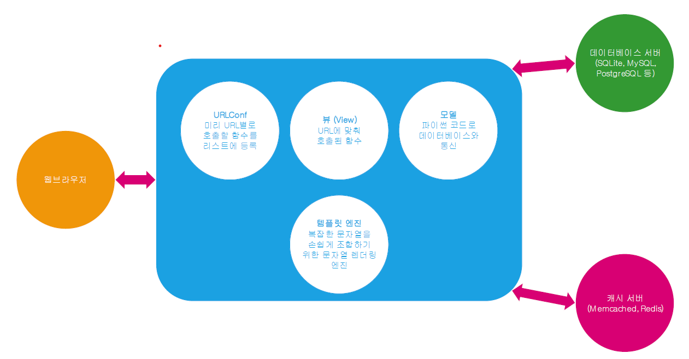

#### 웹 어플리케이션 기본 구조



### 장고 앱
현재 프로젝트의 블로그의 기능을 다른 프로젝트에서도 사용하고 싶다.   
앱을 하나의 작은 서비스로 보면 된다.  
재사용성의 단위로 끊어서 표현
```shell
python managy.py startapp blog1
```
새롭게 생성한 장고앱은 settings에 등록해야 됨

### 모델 및 admin 등록

```python
#blog1.models.py
from django.conf import settings
from django.db import models

# Create your models here.
class Post(models.Model):
    author = models.ForeignKey(settings.AUTH_USER_MODEL, on_delete=models.CASCADE,
                               related_name='+') # reverse_name을 포기함
    title = models.CharField(max_length=100)
    content = models.TextField()
    created_at = models.DateTimeField(auto_now_add=True)
    updated_at = models.DateTimeField(auto_now=True)
```

```python
#askcompany.settings.py
INSTALLED_APPS = [
    'blog1',
]
```

```shell
python manage.py makemigrations blog1
python manage.py migrate blog1
```
```python
#blog1.admin.py
from .models import Post
# Register your models here.
admin.site.register(Post)
```

웹브라우저에서 확인하면 방금생성한 Post 테이블 존재

### 뷰  및 템플릿 연동

```python
#askcompany.urls.py
from django.contrib import admin
from django.urls import path, include

urlpatterns = [
    path('admin/', admin.site.urls),
    path('blog1/', include('blog1.urls'))
]
```

```python
#blog1.urls.py
from . import views
from django.urls import path

app_name ='blog1'

urlpatterns = [
    path('', views.post_list, name='post_list'), #매핑, 함수를 넘긴다. (일급함수 참고)
]
```

```python
#blog1.views.py
from django.shortcuts import render
from .models import Post

#어떤 요청이 오면 호출되는 함수를 views에 정리한다.
def post_list(request):
    qs = Post.objects.all() #QuerySet
    #render 함수의 인자는 3개이다.
    return render(request, 'blog1/post_list.html',{
        'post_list': qs,
    })
```

```html
// blog1.templates.blog1.post_list.html

<h1>Post List</h1>


    <h2>{{ post.title}} </h2>
    {{ post.content }}

```


### 장고앱 생성 작업

1. 앱 생성
2. 앱이름/urls.py 파일 생성
3. 프로젝트/urls.py에 include 적용
4. 프로젝트/settings.py의 INSALLED_APPS에 앱 이름 등록

