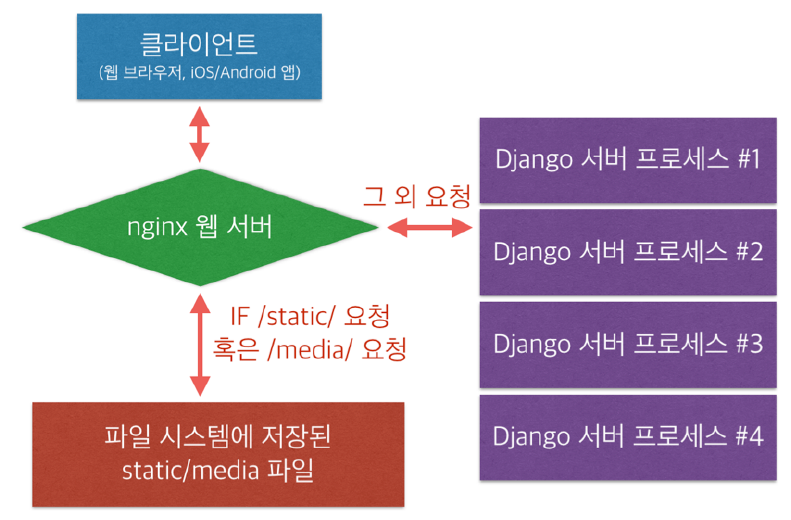
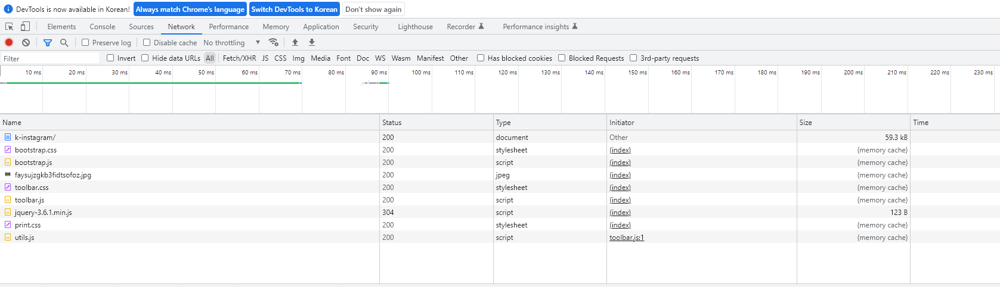

# 웹 프론트엔드 기초


목차  
------

[1. Overview](#Overview)   

[2. CSS](#CSS)

[3. JavaScript](#JavaScript)

[4. 개발서버접속](#개발서버접속)

[5. Static 파일](#Static-파일)


##  Overview

### 웹 프론트엔드를 위한 3가지 언어

* HTML

* CSS

* JavaScript

  

**CSS와 javascript를 분리하는 이유**

```html
<!doctype html>
<html>
<head>
    <meta charset="utf-8" />
    <title>AskDjango Blog</title>
    <link href="blog.css" />
</head>
<body>
    <ul id="post_list">
        <li class="post">장고 기본편</li>
        <li class="post">서비스 배포하기</li>
    </ul>
	<script src="blog.js"></script>
</body>
</html>
var
```

```css
body {
background-color: lightyellow;
}
#post_list .post {
margin-bottom: 3px;
}
```

```javascript
var posts = document.getElementsByClassName('post');

for(var i=0; i<posts.length; i++) {
	var post = posts[i];
	post.style.backgroundColor = 'pink';
}
```


why?

* HTML 응답 body의 크기를 줄일 수 있다.
* 새로고침시 캐싱기능 활용, 서버로부터 다시 읽어들이지 않음
* 웹페이지 응답성을 높일 수 있다. 


개발방법

CSS 소스코드 - 처음에는 css 날코딩, 향후에는   sass, less 검토할 것

Javascript - 처음에는 javascript 날코딩, 향후에는 typescript 검토


### 웹프론트와 백엔드

장고는 백엔드에 초점이 맞춰진 웹프레임워크임

장고를 공부할 때는 백엔드에 포커스를 맞춰서 공부하고 웹프론트엔드는 최소화 할 것

프론트앤드 개발언어 - HTML/CSS/JavaScript (브라우저에서 실행이 된다.  C++도 프론트앤드가 될 수 있다.)

백엔드 개발언어 - Python, NodeJS, Ruby, Java


### 웹요청 및 응답

웹은  HTTP(S) 프로토콜로 동작한다.

웹서버 구성에 따라 특정 요청에 대한 응답을 Apache/Nginx 웹서버도 할 수 있고,

Django 뷰에서 응답할 수도 있다. 


### 일반적인 장고 페이지의 예

뷰: 포스팅 목록

```python
# blog/urls.py
from django.urls import path
from . import views
urlpatterns = [
	path('blog/', views.post_list, name='post_list'),
]
# blog/views.py
from django.shortcuts import render
from .models import Post
def post_list(request):
    return render(request, 'blog/post_list.html', {
    	'post_list': Post.objects.all(),
})
```

HTML  템플릿

``` html
<!doctype html>
<html>
<head>
    <meta charset="utf-8" />
    <title>AskDjango Blog</title>
    </head>
<body>
    <h1>AskDjango Blog</h1>
    <ul>
        
            <li>
          	  {{ post.title }}
            </li>
        
    </ul>
    <hr/>
    &copy; 2019, AskDjango.
</body>
</html>
```


하나의 HTML요청에 대해 하나의 응답을 받는다.   

*  브라우저에서 서버로 HTTP 요청
* 관련 뷰함수 호출
* 뷰함수 리턴을 해야만 비로소 HTTP 응답 시작
* 브라우저는 HTTP 문자열 응답을 1줄씩 해석


### HTML UI 응답성을 높이기 위해

* CSS/Javascript 파일을 minify 한다.  (네이버 페이지 소스 보기에서 css 들어가 보면 된다.)   
* CSS를 HTML  컨텐츠보다 앞에 위치 시키다. (스타일이 적용되지 않은 컨텐츠가 노출되는 것 방지.)   
* JS는  HTML  컨텐츠보다 뒤에 위치 시킨다.    


## CSS

### CSS란?

MSN 웹 문서 : https://developer.mozilla.org/ko/docs/Web/CSS  참고   

개발자도구 클릭하면 elements에서 그에대한 스타일이 나온다.    

CSS Layout으로 작성하면?

* 코드 용량 절감
* 사람이나 컴퓨터가 이해하기 쉬운 구조
* 쉬운 유지보수

### 반응형웹

브라우저의 가로크기에 따라 각기 다른 CSS 스타일 적용

```css
/* 브라우저의 가로크기가 600px 이하일 경우, 아래 스타일이 적용 */
@media (max-width: 600px) {
body {
background-color: green;
}
}
```


post_list.html에서 다음과 같이 수정   

아래 스타일 코드 참고 


```html
<html lang="ko">
<head>
    <meta charset="utf-8"/>
    <title>Instagram / Post List</title>
    <link rel="stylesheet" href="https://cdn.jsdelivr.net/npm/bootstrap@5.2.1/dist/css/bootstrap.min.css" rel="stylesheet" integrity="sha384-iYQeCzEYFbKjA/T2uDLTpkwGzCiq6soy8tYaI1GyVh/UjpbCx/TYkiZhlZB6+fzT" crossorigin="anonymous">
    <style>
        @media (max-width: 600px) {
            body {
                background-color: green;
            }
        }
    </style>
</head>
```


### CSS  Framework

기본적인 CSS 스타일을 이미 구성

시작은 쉽게 하되 좋은 디자인을 위해서는 커스텀이 필요한 시점이 온다. 

Best CSS framework

* Bootstrap
* Materialize CSS
* Semantic UI

 가장 레퍼런스가 많은 Bootstrap5 http://getbootstrap.com


### Bootstrap 스타일 적용하기 

```html
<head>
    <meta charset="utf-8"/>
    <title>Instagram / Post List</title>
    <link rel="stylesheet" href="https://cdn.jsdelivr.net/npm/bootswatch@4.5.2/dist/simplex/bootstrap.min.css" integrity="sha384-FYrl2Nk72fpV6+l3Bymt1zZhnQFK75ipDqPXK0sOR0f/zeOSZ45/tKlsKucQyjSp" crossorigin="anonymous">
{#    <link rel="stylesheet" href="https://cdn.jsdelivr.net/npm/bootswatch@4.5.2/dist/darkly/bootstrap.min.css" integrity="sha384-nNK9n28pDUDDgIiIqZ/MiyO3F4/9vsMtReZK39klb/MtkZI3/LtjSjlmyVPS3KdN" crossorigin="anonymous">#}
{#    <link rel="stylesheet" href="https://cdn.jsdelivr.net/npm/bootstrap@5.2.1/dist/css/bootstrap.min.css" rel="stylesheet" integrity="sha384-iYQeCzEYFbKjA/T2uDLTpkwGzCiq6soy8tYaI1GyVh/UjpbCx/TYkiZhlZB6+fzT" crossorigin="anonymous">#}
    <script src="https://cdn.jsdelivr.net/npm/bootstrap@5.2.2/dist/js/bootstrap.min.js" integrity="sha384-IDwe1+LCz02ROU9k972gdyvl+AESN10+x7tBKgc9I5HFtuNz0wWnPclzo6p9vxnk" crossorigin="anonymous"></script>
    <style>
        @media (max-width: 600px) {
            body {
                background-color: green;
            }
        }
    </style>
</head>

```

### Layout 적용하기

layout.html

```html
<!doctype html>
<html lang="ko">
<head>
    <meta charset="utf-8"/>
    <title>  </title>
    <link rel="stylesheet" href="https://cdn.jsdelivr.net/npm/bootswatch@4.5.2/dist/simplex/bootstrap.min.css" integrity="sha384-FYrl2Nk72fpV6+l3Bymt1zZhnQFK75ipDqPXK0sOR0f/zeOSZ45/tKlsKucQyjSp" crossorigin="anonymous">
    <script src="https://cdn.jsdelivr.net/npm/bootstrap@5.2.2/dist/js/bootstrap.min.js" integrity="sha384-IDwe1+LCz02ROU9k972gdyvl+AESN10+x7tBKgc9I5HFtuNz0wWnPclzo6p9vxnk" crossorigin="anonymous"></script>
    <style>
        @media (max-width: 600px) {
            body {
                background-color: green;
            }
        }
    </style>
</head>
<body>
    
    
</body>
</html>

```

post_detail.html

```html




    Post Detail pk# {{ post.pk }}



    <h2>Author: {{ post.author }}</h2>


    <div>
        
    </div>


    {{ post.message }}
    <hr/>
    <a href="" class="btn btn-primary">
        목록
    </a>


```

post_list.html

```html




    Instagram / Post List



       <form action="" method="get">
        <input type="text" name="q" value="{{ q }}"/>
        <input type="submit" value="검색"/>
    </form>

    <table class="table table-bordered table-hover">
        <tbody>
            
                <tr>
                <td>
                    {{ post.pk }}
                </td>
                    <td>
                        
                            
                        
                            No Photo
                        
                    </td>
                    <td>
                        <a href={{ post.get_absolute_url }}>
{#                        <a href="">#}
{#                        <a href="/instagram/{{ post.id }}">#}
                            {{ post.message }}
                        </a>

                    </td>
                </tr>
            
        </tbody>
    </table>
{#    {{ is_paginated }}#}
{#    {{ page_obj }}#}
    
        
    



```


getbootstrap.com에 가면 여러가지 example이 있다. 

이중에서 navigation 메뉴을 선택한다음 필요한 항목을 copy -> outerhtml 한다.

그리고 다음과 같이 붙여 넣기 한다. 

```html
<nav class="navbar navbar-expand-md navbar-dark fixed-top bg-dark">
  <div class="container-fluid">
    <a class="navbar-brand" href="#">Fixed navbar</a>
    <button class="navbar-toggler" type="button" data-bs-toggle="collapse" data-bs-target="#navbarCollapse" aria-controls="navbarCollapse" aria-expanded="false" aria-label="Toggle navigation">
      <span class="navbar-toggler-icon"></span>
    </button>
    <div class="collapse navbar-collapse" id="navbarCollapse">
      <ul class="navbar-nav me-auto mb-2 mb-md-0">
        <li class="nav-item">
          <a class="nav-link active" aria-current="page" href="#">Home</a>
        </li>
        <li class="nav-item">
          <a class="nav-link" href="#">Link</a>
        </li>
        <li class="nav-item">
          <a class="nav-link disabled">Disabled</a>
        </li>
      </ul>
      <form class="d-flex" role="search">
        <input class="form-control me-2" type="search" placeholder="Search" aria-label="Search">
        <button class="btn btn-outline-success" type="submit">Search</button>
      </form>
    </div>
  </div>
</nav>
```


layout.html에서 그리드 시스템 적용

한행을 12칸으로 나눠서 그리드 처리

```html
<div class="container">
    <div class="row">
        <div class="col-sm-12">
                
                
        </div>
    </div>
</div>
```

## JavaScript

웹브라우저 내에서 주로 구동되던 프로그래밍 언어  

구글이 크롬 브라우저에 사용되는 V8엔진을 오픈소스로 공개   

* 자바스크립트를 실행하기 전에 컴파일 한 후에 실행  

* v8엔진을 통해 nodejs 플랫폼이 개발됨  

nodejs 는 범용 Javascript SW 플랫폼  


### jQuery

웹프론트엔드 자바스크립트계의 혁명  

2006년 jQuery 출시   

Ajax, DOM  조작이 편리함   

최근에는 안쓰는 경우가 많음  

https://trends.google.com/trends/explore?date=today%205-y&geo=KR&q=vuejs,%2Fm%2F0268gyp,%2Fm%2F012l1vxv,%2Fm%2F0j45p7w

jQuery를 이해하는 것이 좋음  

왜냐하면 django의 admin도 jquery로 구현되어 있음  

구글 검색에서 "jquery를 쓰면 안되는 이유"    

그래도 공부는 해야 됨 --> 기존에 구현된 페이지를 이해하기 위해   


### jQuery  적용해 보기

```javascript
<script src="https://code.jquery.com/jquery-3.4.1.min.js"></script>
<script>
// 이후에 필요한 자바스크립트 코드 구현
// jQuery에 대한 별칭 : $
$(function() {
 console.log("웹페이지 로딩 완료");
});
</script>
```

javascript 오류는 항상  개발자도구의  Console 창에서 확인한다.   

console.log("test") 하면 console 창에서 값을 확인할 수 있다.  


### Event Listener 등록

onload Event Listener  등록

```javascript
<script>
$(document).ready(function() {
	console.log("웹페이지 로딩 완료");
});
</script>

// 축약표현
<script>
$(function() {
	console.log("웹페이지 로딩완료");
});
</script>
```


click 이벤트 리스너 등록

```html
<a id="btn-naver-1" href="http://m.naver.com" target="_blank">Naver Button 1</a>
<a id="btn-naver-2" href="http://m.naver.com" target="_blank">Naver Button 2</a>
<ul id="my-list">
    <li>list1</li>
    <li>list2</li>
    <li>list3</li>
</ul>

<script>
$(function() {
    // 리스너에 리턴값이 없기 때문에, 아래 리스너가 호출 + 본연의 href 링크가 동작
    $('#btn-naver-1').click(function() {
    	console.log('clicked btn-naver-1');
    });
    // 아래 리스너가 호출되지만, href 링크는 동작하지 않습니다.
    $('#btn-naver-2').click(function(e) {
    	e.preventDefault(); // 디폴트 동작 수행 방지. 혹은 return false; 도 동일한 효과
    	console.log('clicked btn-naver-2');
    // return false; // true를 리턴하면, 위 태그 클릭 시의 디폴트 동작 수행
    });
    $('#my-list li').click(function() {
    	var content = $(this).html();
    	console.log('clicked : ' + content);
    });
});
</script>
```


submit  이벤트 리스너 등록

```javascript
//form 본연의 action은 없고,
//아래 submit 내의 함수가 실행되는데
//e.preventDefault()이므로 form 본연 기능은 안되고
//console.log만 실행된다.
//form 본연의 기능이 아니라 javascript를 통해서 기능을 구현하고 싶을때 사용한다.

<form id="query-form">
    <input type="text" name="query" />
    <input type="submit" value="조회" />
</form>

<script>
    $(function() {
        $('#query-form').submit(function(e) {
            e.preventDefault();
            console.log("form submit");
        });
     });
</script>
```


### DOM  엘리먼트 추가/제거 

lotto-btn dtn을 클릭하면 lotto-list 에 값을 추가한다.  

remove-at-first을 클릭하면 lotto-list의 첫번째 값을 삭제한다.  

remove-at-last를 클릭하면 lotto-list의 마지막값을 삭제한다.  

```html
<button id="lotto-btn">로또 번호를 점지해주세요.</button>
<button id="remove-at-first">처음을 삭제</button>
<button id="remove-at-last">마지막을 삭제</button>
<div id="lotto-list"></div> 

<script>
    $(function() {
        $('#lotto-btn').click(function() {
                var rendered = '<div class="post">로또 번호를 뽑아봅시다 : ' +
                                (new Date()) + '</div>';
                // var container = $('#lotto-list').append(rendered);
                var $added = $(rendered).appendTo('#lotto-list'); // 추가된 jQuery객체를 리턴
                $added.click(function() {
                    $(this).remove(); // 각 항목
                });
        });
        $('#remove-at-first').click(function() {
            $('#lotto-list div:first').remove();
        });
        $('#remove-at-last').click(function() {
            $('#lotto-list div:last').remove();
        });
    });
</script>
```


별도 템플릿을 통한 추가 

```html
// post-template 전체를 문자열로 가져와서 처리한다.
// 이때 post-template는  javascript가 아니라 임의의 type 이어야 됨
// underscore 라이브러리를 활용하여 _.template 함수를 통해 탬플릿화 한다.
// 템플릿은 안에 numbers와 bonus가 치환이 가능하게 한다. (마치 장고처럼)


<button id="lotto-btn">로또번호 생성하기</button>
<div id="lotto-list"></div>
<script id="post-template" type="text/x-template">
<div class="post">
	당첨번호는 <%= numbers %>이며, 보너스 번호는 <%= bonus %>입니다.
</div>
</script>

<script src="https://code.jquery.com/jquery-3.4.1.min.js"></script>
<script src="https://cdnjs.cloudflare.com/ajax/libs/underscore.js/1.9.1/underscore-min.js"></script>
<script>
$(function() {
    var raw_template = $('#post-template').html(); /
    var tpl = _.template(raw_template);
    
    $('#lotto-btn').click(function() {
        var sample = _.sample(_.range(1, 46), 6);
        var rendered = tpl({
            numbers: sample.slice(0, 5).sort(function(x, y) { return x - y; }),
            bonus: sample[5]
        });
        console.log(rendered);
        $(rendered).appendTo('#lotto-list');
    });
});
</script>

```


### Ajax GET/POST 요청 

 jQuery를 통해서 용이하게 Get/Post 요청이 가능하게 되었다.   


브라우저의 동일 도메인 참조 정책(Same-Origin Policy 정책)   

* 같은 프로토콜/호스트명/포트 내에서만 Ajax 요청이 가능한 브라우저의 보안정책
* 한 회사에 여러개의 API 서버가 있는 경우?
* Cross Domain Request를 허용하기 위해서 CORS (Cross Origin Resource Sharing) 지원
* 요청을 받는 서버측 셋업이 필요하고,  장고는  django-cors-headers 라이브러리 활용

CSRF  Token 체크

* 장고 뷰에서는 Post를 받을 때 CSRF Token 값을 체크

* 없으며, 400 Bad Request 응답

  

다른 도메인에 요청하므로 실패하는 Ajax GET  요청  

```html
<!doctype html>
<html>
    <head>
        <meta charset="utf-8" />
        <script src="https://code.jquery.com/jquery-3.4.1.min.js"></script>
        <script>
            $.ajax({
                method: "GET",
                url: 'https://www.melon.com/search/keyword/index.json?jscallback=?',
                data: {query: '윤종신'},
                cache: false // true 지정 : GET인자로 "_={timestamp}" 를 붙여줍니다. 매번 URL이 달라지므로 브라우저 캐싱이 되지 않습니다.
            })
            .done(function(response, textStatus, xhr) {
                console.group("done");
                console.log(response)
                console.log(textStatus);
                console.log(xhr);
                console.groupEnd();
            })
            .fail(function(xhr, textStatus, error) {
                console.group("fail");
                console.log(xhr)
                console.log(textStatus);
                console.log(error);
                console.groupEnd();
            })
            .always(function(response_or_xhr, textStatus, xhr_or_error) {
                // 인자가 done/fail 인자 매핑과 동일
                console.log("always");
            });
        </script>
    </head>
</html>
```


Has been blocked by CORS policy: No Access-Cointrol-Allow-Origin


해결책이 있다. Get방식에서만 되는데 jsonp를 사용하는 것이다. 

위의 코드에서 이부분만 바꾼다.


```javascript
$.ajax({
    method: "GET",
    url: 'https://www.melon.com/search/keyword/index.json?jscallback=?',
    data: {query: '윤종신'},
    dataType: 'jsonp',  //이 부분만 바꾼다. 
    cache: false 
})
```


## 개발서버접속

### 개발 서버 옵션

python manage.py runserver 하면 127.0.0.1로 바인딩하면 로컬에서만 접속가능   

python manage.py runserver 0.0.0.0:8000 로 하면 외부에서도 접속허용   

추가로 장고 4부터 csrf 체킹로직 강화   

이를 대응하기 위해서는 CSRF_TRUSTED_ORIGINS = ['https://ngrok주소'] 와 같이 설정한다. 

ALLOWED_HOSTS에 허용할 호스트 지정함   


## Static 파일

### static 파일

개발 리소스로서의 정적인 파일 (js, css, image 등)


### 장고 static 파일 경로

장고는 one project, multi app의 구조를 가짐

App을 위한 static 파일을 `app/static/app` 경로에 둔다.   

프로젝트 전반에 사용되는 static 파일은 `settings.STATICFILES_DIRS`에 둔다.

collectstatic 이라는 명령을 통해서 흩어진 파일을 모은다.   


**추천 Static File 셋팅**

```python
# 탬플릿 태그 에 의해서 참조되는 설정
STATIC_URL = '/static/'

# python manage.py collectstatic 명령이 참조되는 설정
# 흩어진 static 파일들을 하나의 폴더로 복사한다. 웹서버에 의해 서비스가 되기 위해 한다.
# 배포시에만 사용한다. 개발시에는 사용하지 않는다. 
STATIC_ROOT = os.path.join(BASE_DIR, 'static')

# File system loader에 의해 참조되는 설정
STATICFILES_DIRS = [
    os.path.join(BASE_DIR, 'askcompany', 'static')
]
```


### 템플릿에서 static URL 처리


방법1. settings.STATIC_URL, Prefix를 하드코딩하기

```python
# 잘못된 하드코딩 사례

```


빙법2. Templage Tag를 통한 처리

```python
# static template tag를 활용한다.
# settings.STATIC_URL = '/static/' 이라고 미리 셋팅되어 있어야 함


```


### 개발환경에서의 static 파일 서빙

개발서버를 쓰고,   settings.DEBUG = True 일 때에만 지원   

순수 개발목적으로만 제공   

개발서버를 쓰지 않거나  settings.DEBUG = False 일때는 지원하지 않는다.   

굳이 장고 application 단에서는 정적 서빙 기능을 사용하지 않는다.    


개발 서버에서는 실제 별도 경로에 존재하지만 외부에서는 동일 경로에서 존재하는 것처럼 보이게 한다. 

```shell
myproj/static/main.css => http://localhost:8000/static/main.css 경로로 접근 가능
myproj/static/jquery/jquery-3.4.1.min.js => http://localhost:8000/static/jquery/jquery-3.4.1.min.js
myproj/static/bootstrap/4.3.1/css/bootstrap.min.css => http://localhost:8000/static/bootstrap/4.3.1/css/bootstrap.min.css
blog/static/blog/style.css => http://localhost:8000/static/blog/style.css 경로로 접근 가능
blog/static/blog/blog.js => http://localhost:8000/static/blog/blog.js 경로로 접근 가능
shop/static/shop/shop.js => http://localhost:8000/static/shop/shop.js 경로로 접근 가능
```


### Static 서빙을 하는 방법

* 클라우드 정적 스토리지 활용 (예: 아마존 s3)
* apache/nginx 웹서버등을 통한 서빙
* 장고를 통한 서빙 : whitenoise 라이브러리를 통해 활용


### collectstatic 명령

*  static  파일들을 한 곳으로 복사
* python manage.py collectstatic
* 이렇게 하면 settings.STATIC_ROOT에 지정한 경로에 파일이 한곳에 모이게 됨


### 외부 웹서버에 의한 서비스




nginx 웹서버에서의 static 설정 예시

```shell
server {
    # 중략
    location /static {
        autoindex off;
        alias /var/www/staticfiles; # settings.STATIC_ROOT
    }
    location /media {
        autoindex off;
        alias /var/www/media; # settings.MEDIA_ROOT
    }
}
```


### 배포시 static 처리 프로세스

1. “서비스용settings”에 배포 static 설정
2. 관련 클라우드 스토리지 설정, 혹은 아파치/nginx static 설정
3. 개발이 완료된 static파일을, 한 디렉토리로 복사
   python manage.py collectstatic --settings=서비스용settings
   Storage 설정에 따라, 한 번에 클라우드 스토리지로의 복사를 수행되기도 함.
   settings.STATIC_ROOT 경로로 복사됨.
4. settings.STATIC_ROOT경로에 복사된 파일들을 배포서버로 복사
   대상 : 클라우드 스토리지, 혹은 아파치/nginx에서 참조할 경로
5. static 웹서버를 가리키토록 sesttings.STATIC_URL 수정   


### Bootstrap 서빙 실습

1. getbootstrap.com, download에 간 다음에 compiled css and js 다운로드 받는다. 

2. settings.STATICFILES_DIRS에 언급한 경로에 넣어둔다.

   `\dev\DjangoStudy\askcompany\askcompany\statiic\bootstrap-5.2.2-dist`

3. 관련된 jquery도 다운로드 받는다. jquery.com 확인
4. 다운받은 파일을 static 폴더 밑에 옮겨준다. 
5. layout.html 에서 경로를 수정한다. 

```html
<!doctype html>

<html lang="ko">
<head>
    <meta charset="utf-8"/>
    <title>  </title>
    <link rel="stylesheet" href="">
    <script src=""></script>
    <script src=""></script>
    <style>
        body {
            padding-top: 5rem;
            padding-bottom: 2rem ;
        }
    </style>
</head>
```

6. 최종적으로 에러가 없는지 확인한다. 



view page 소스에도 주소를 확인한다. 

```html

<!doctype html>

<html lang="ko">
<head>
    <meta charset="utf-8"/>
    <title> 
    Instagram / Post List
</title>
    <link rel="stylesheet" href="/static/bootstrap-5.2.2-dist/css/bootstrap.css">
    <script src="/static/jquery-3.6.1.min.js"></script>
    <script src="/static/bootstrap-5.2.2-dist/js/bootstrap.js"></script>
    <style>
        body {
            padding-top: 5rem;
            padding-bottom: 2rem ;
        }
    </style>
</head>
```

브라우저 개발자도구 코드에서도 별다른 에러가 없음을 확인한다. 

7. 마지막으로 collectstatic을 한다. 

   staticfiles에 bootstrap과 jquery가 한데 모이게 된다.
