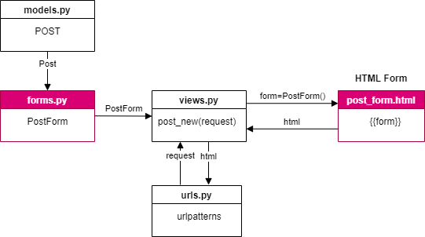
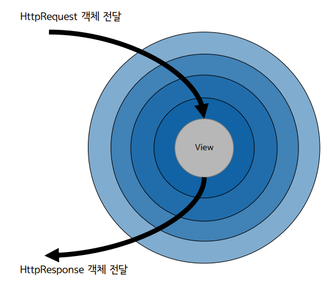
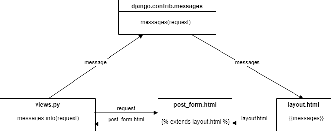

# 장고 Forms


목차  
------

[1. HTML Form](#1.-HTML-FORM)

[2. HTTPRequest & HTTPResponse](#2.-HTTPRequest-&-HTTPResponse)

[3. Django Form](#3.-Django-Form)

[4. CSRF](#4.-CSRF)

[5. ModelForm](#5,-ModelForm)

[6. Form Valication](#6,-Form-Valication)

[7. Message Framework](#7.-Message-Framework)

[8.Forms를 통한 삭제 구현](#8-forms를-통한-삭제-구현)

[9. 장고 기본 CBV API](#9.-장고-기본-CBV-API)

   


## 개요

### 기본 구조


 

### 코드

```python
# models.py
class Post(models.Model):
    message = models.TextField(
        validators=[MinLengthValidator(10)]
    )  # 최소 10글자 제약 유효성 검사, admin단에서도 바로 확인 가능
```

```python
# forms.py

from django import forms
from .models import Post
# 모델 Form  설계
class PostForm(forms.ModelForm):
    class Meta:
        model = Post
        fields = "__all__"
```

```python
#views.py

def post_new(request):
    if request.method == "POST":
        form = PostForm(request.POST, request.FILES)
        if form.is_valid():
            post = form.save()  # 방금 저장한 모델 인스턴스 반환
            return redirect(post)  # 저장을 하고 이동이 되게 한다.
    else:
        form = PostForm()

    return render(
        request,
        "instagram/post_form.html",  # 폼을 보여준다.
        {
            "form": form,
        },
    )

```

```html
<!--post_form.html

<form action="" method="post" enctype="multipart/form-data">
    
    <!-- 폼을 쓸때는 테이블로 감싸야 된다. -->
    <table>
        {{ form }}
    </table>
    <input type="submit" value="저장" />
</form>
```

```python
#urls.py
urlpatterns = [
    path("new/", views.post_new, name="post_new"),
]
```


##  1. HTML Form

### 개요

* HTML  Form
  * 사용장에게 입력폼을 제공하고 이를 서버로 전송한다. <form> 태그 활용 
* Django Form
  * 유효성을 검사한다. 
  * Get/Post 요청을 보내면 서버에서 응답 HTML을 보내줌

### HTML Form

* 구성요소

  * < form>  태그 - 입력폼 구성
  * action - 요청을 보내 주소임. 해당 url로 데이터 전송을 시도
  * method : 전송방식
    * Get - 데이터 조회시 활용
    * Post - 생성/수정/삭제에서 사용
  * enctype - 인코딩 방식
  * widget 

* 코드

  ```html
  <form action="" method="POST">
      <input type="text" /> <!-- 1줄 문자열 입력 -->
      <textarea></textarea> <!-- 1줄 이상의 문자열 입력 -->
      <select></select> <!-- 항목 중 택일 -->
      <input type="checkbox" /> <!-- 체크박스 (한 그룹 내 여러 항목을 다수 선택 가능) -->
      <input type="radio" /> <!-- 라디오박스 (한 그룹 내 여러 항목 중에 하나만 선택 가능) -->
      그 외 다수 위젯
  </form>
  ```

*  Form의 enctype

  * "application/x-www-form-urlencoded" (디폴트)

    Get 방식에서 강제됨   

    파일 업로드는 불가

    URL 인코딩을 통해서 인자들을 QueryString 형태로 전달

    

  * "multipart/form-data"

    * 파일 업로드 가능

#### url encode

*  key=value의 값의 쌍이 & 문자로 이어진 형태

* utf8 인코딩 방식을 사용한다. 

  ```python
  from urllib.parse import urlencode
  print(urlencode({'key1': 'value1', 'key2': 10, 'name': '방탄소년단'}))
  print('방탄소년단'.encode('utf8'))
  print(''.join('%{:X}'.format(ch) for ch in '방탄소년단'.encode('utf8')))
  
  ### 결과 
  key1=value1&key2=10&name=%EB%B0%A9%ED%83%84%EC%86%8C%EB%85%84%EB%8B%A8
  b'\xeb\xb0\xa9\xed\x83\x84\xec\x86\x8c\xeb\x85\x84\xeb\x8b\xa8'
  %EB%B0%A9%ED%83%84%EC%86%8C%EB%85%84%EB%8B%A8
  ```

#### Form Method

* Form  요청에서 인자를 보내는 2가지 방법

* 요청 URL 뒤에 ? 를 붙이고 인자를 실어서 보내기

  *  QueryString 활용 

* 요청 Body에 모든 인코딩의 인자를 실어서 보내는 방법

  * Get 요청에서는 Header만 존재한다. 
  * Post 요청에서는 Body 존재한다. 
  * Client ->  서버로 요청하거나 서버에서 응답할때도 사용한다.

* Get 방식

  * 메세지만 보낼 수 있다.

  * Header 만 있다.

    ```html
    <form method="GET" action="">
        <input type="text" name="query" />
        <input type="submit" value="검색" />
    </form>
    ```

    <form method="GET" action="">
        <input type="text" name="query" />
        <input type="submit" value="검색" />
    </form>
    
    

    ```html
    ## 이렇게 하면 안됨
    <form method="GET" action="">
        <input type="text" name="title" />
        <textarea name="content"></textarea>
        <input type="file" name="photo" />
        <input type="submit" value="저장" />
    </form>
    ```

    

* Post 방식

  * 데이터도 보낼 수 있다.

  * Header + Body가 있다.

    ```html
    <form method="POST" action="" enctype="multipart/form-data">
        <input type="text" name="title" />
        <textarea name="content"></textarea>
        <input type="file" name="photo" />
        <input type="submit" value="저장" />
    </form>
    ```

* 장고 View 에서의 인자 접근

  * request.GET
    * 모든 QueryString 인자 목록
    * QueryString을 파싱한 QueryDict 객체
    * GET/POST 요청에서 모두 가능
  * request.POST
    * POST 요청에서만 가능.
    * 파일 내역은 제외한 모든 POST인자 목록
    * "요청 BODY"를 파싱한 QueryDict 객체
  * request.FILES
    * POST 요청에서만 가능.
    * "요청 BODY"에서 파일내역만 파싱한 MultiValueDict 객체

[목차로 이동](#목차)   

## 2. HTTPRequest & HTTPResponse

### HTTPRequest 객체

* 클라인언트로부터 모든 요청 내용을 담고 있다. 
* .GET, .POST, .FILES  인자를 통해 참조할 수 있다.

#### MultiValueDict

* dict을 상속받은 클래스

* 동일키 다수 value를 지원하는 사전

* name=Tom&name=Steve&name=Tomi

* https://github.com/django/django/blob/3.0.2/django/utils/datastructures.py#L42

  ```python
  >>>	from django.utils.datastructures	import MultiValueDict
  >>>	d	=	MultiValueDict({'name':	['Adrian',	'Simon'],	'position':	['Developer']})
  >>>	d['name'] # dict과 동일하게 동작. 단일값을 획득
  'Simon'
  >>>	d.getlist('name') # 다수값 획득을 시도. 리스트를 반환
  ['Adrian',	'Simon']
  >>>	d.getlist('doesnotexist')		# 없는 Key에 접근하면 빈 리스트를 반환
  []
  >>>	d['name']	=	'changed'
  >>>	d
  <MultiValueDict:	{'name':	['changed'],	'position':	['Developer']}
  ```

#### QueryDict

```python
class QueryDict(MultiValueDict):
    _mutable	=	True
    _encoding	=	None
    def __init__(self,	query_string=None,	mutable=False,	encoding=None):
        #	...
        self._mutable	=	mutable
    def _assert_mutable(self):
        if not self._mutable:
        raise AttributeError("This	QueryDict	instance	is	immutable")
    def __setitem__(self,	key,	value):
        self._assert_mutable()
        #	...
    def __delitem__(self,	key):
        self._assert_mutable()
        #	...
        #	...
```

### HTTPResponse

* 이미지, HTML 문자열등, 다양한 응답을 wrapping

* View에서는 반환값으로서 HttpResponse를 기대한다. 

* MiddleWare

  ```python
  #	프로젝트/settings
  MIDDLEWARE	=	[
      'django.middleware.security.SecurityMiddleware',
      'django.contrib.sessions.middleware.SessionMiddleware',
      'django.middleware.common.CommonMiddleware',
      'django.middleware.csrf.CsrfViewMiddleware',
      'django.contrib.auth.middleware.AuthenticationMiddleware',
      'django.contrib.messages.middleware.MessageMiddleware',
      'django.middleware.clickjacking.XFrameOptionsMiddleware',
  ]
  ```

  

#### Filelike 객체

```python
response	=	HttpResponse(
    "<p>Here's	the	text	of	the	Web	page.</p>"
    "<p>Here's	another	paragraph.</p>"
)
response	=	HttpResponse()
response.write("<p>Here's	the	text	of	the	Web	page.</p>")
response.write("<p>Here's	another	paragraph.</p>")
```

#### JsonResponse

웹 API 응답을 할 때 사용하는 포맷의 한 종류

https://docs.djangoproject.com/en/2.1/ref/request-response/#jsonresponse-objects

```python
from django.core.serializers.json	import DjangoJSONEncoder
class JsonResponse(HttpResponse):
    def __init__(self,	data,	encoder=DjangoJSONEncoder,	safe=True,
    	json_dumps_params=None,	**kwargs):
    if safe	and not isinstance(data,	dict):
    	raise TypeError(
    		'In	order	to	allow	non-dict	objects	to	be	serialized	set	the	'
    		'safe	parameter	to	False.')
    if json_dumps_params	is None:
    	json_dumps_params	=	{}
    kwargs.setdefault('content_type',	'application/json')
    data	=	json.dumps(data,	cls=encoder,	**json_dumps_params)
    super().__init__(content=data,	**kwargs)
```

#### StreamingHttpResponse

* 긴 응답을 효율적으로 처리하기 위함

* 조금씩 생성할때 마다 응답을 준다. 

* 큰 응답시에는 극심한 성능 저하로 이어질 수 있음.

  https://docs.djangoproject.com/en/3.0/howto/outputting-csv/

  ```python
  import csv
  
  from django.http import StreamingHttpResponse
  
  class Echo:
      """An object that implements just the write method of the file-like
      interface.
      """
      def write(self, value):
          """Write the value by returning it, instead of storing in a buffer."""
          return value
  
  def some_streaming_csv_view(request):
      """A view that streams a large CSV file."""
      # Generate a sequence of rows. The range is based on the maximum number of
      # rows that can be handled by a single sheet in most spreadsheet
      # applications.
      rows = (["Row {}".format(idx), str(idx)] for idx in range(65536)) #Generator
      pseudo_buffer = Echo()
      writer = csv.writer(pseudo_buffer)
      response = StreamingHttpResponse((writer.writerow(row) for row in rows), #Generator 표현식
                                       content_type="text/csv")
      response['Content-Disposition'] = 'attachment; filename="somefilename.csv"'
      return response
  ```

#### FileResponse

* https://docs.djangoproject.com/en/3.0/ref/request-response/#fileresponse-objects

  ```python
  >>> from django.http import FileResponse
  >>> response = FileResponse(open('myfile.png', 'rb'))
  ```

[목차로 이동](#목차)   

## 3. Django Form

### 주요 역할

* 입력폼  HTML  생성

* 입력폼에 대한 유효성 검증

* 검증을 통과한 값을  dict  형태로 제공

  ```python
  #	myapp/forms.py
  from django	import forms
  class PostForm(forms.Form):
      title	=	forms.CharField() #TextField는 사용하지 않음
      content	=	forms.CharField(widget=form.Textarea) #widget에서 특별히 변경가능
  ```

* 장고 forms는 user와 interaction을 한다.

* POST/GET 방식을 처리하는 Form  처리하는 일반적인 예제

``` python
def post_new(request):
    if request.method	==	'POST':
    	form	=	PostForm(request.POST,	request.FILES) # 파라미터 순서를 지켜줘야 한다.
        if form.is_valid(): #유효성 검증이 통과하면
            post	=	Post(**form.cleaned_data)
            post.save()
            return redirect(post)
    else: #GET 방식
    	form	=	PostForm()
        
    return render(request,	'blog/post_form.html',	{
    	'form':	form,
	})
```

### Form 사용의 문제점

* Form 과 model은 서로 독립적이다. 
* 그러나 구현할 때는 모델과 폼을 연계하여 구현한다.
* 그래서 모델이 변경되면 폼도 변경된다.
* 유지보수의 문제가 발생하게 된다.
* 이 문제를 해결하기 위해 ModelForm 이란 것이 있다.


### ModelForm

#### 유효성 검사 

```python
#	myapp/models.py
from django	import forms
from django	import models

def min_length_3_validator(value): #유효성 검사 함수 정의
	if len(value)	<	3:
	raise forms.ValidationError('3글자 이상 입력해주세요.')
 
#유효성 검사 로직은 모델에서만 구현하면 된다.
#form에서 구현하지 말고...
class Post(forms.Model):
    title   = models.CharField(max_length=100,validators=[min_length_3_validator]) #유효성 검사 로직 적용
    content	= models.TextField()

#	myapp/forms.py
from django	import forms
from .models import Post

class PostForm(forms.ModelForm):
	class Meta:
		model = Post  #모델에서 정의된 validator 정보를 가져온다.ㅊ
		fields = '__all__'
```

#### view  함수내에서 처리

```python
# myapp/views.py
from .forms import PostForm
if request.method == 'POST':
	# POST 요청일 때
	form = PostForm(request.POST, request.FILES)
else:
	# GET 요청일 때
	form = PostForm()
```

#### view에서 유효성 검증

```python
if request.method == 'POST':
    # POST인자는 request.POST와 request.FILES를 제공받음.
    form = PostForm(request.POST, request.FILES)
    # 인자로 받은 값에 대해서, 유효성 검증 수행
    if form.is_valid(): # 검증이 성공하면, True 리턴
        # 검증에 성공한 값들을 사전타입으로 제공받음.
        # 검증에 성공한 값을 제공받으면, Django Form의 역할은 여기까지 !!!
        # 필요에 따라, 이 값을 DB에 저장하기
        form.cleaned_data
        post = Post(**form.cleaned_data) # DB에 저장하기
        post.save()
		return redirect('/success_url/')
	else: # 검증에 실패하면, form.errors와 form.각필드.errors 에 오류정보를 저장
		form.errors
else: # GET 요청일 때
    form = PostForm()
    return render(request, 'myapp/form.html', {'form': form})
```

#### 템플릿 적용

* Get 요청일때: Form을 채우고 submit하고 POST 요청

* POST  요청 

  ```python
  <table>
      <form action="" method="post">
          
          <table>{{ form.as_table }}</table>
          <input type="submit" />
      </form>
  </table>
  ```

####  Form Fields

* Model Fields와 유사하다
* Models Fields는 Data Fields 들을 파이썬 클래스화
* Form Fields는  HTLM  Form Field 들을 파이썬 클래스화 
* https://docs.djangoproject.com/en/3.0/ref/forms/fields/


[목차로 이동](#목차)   

## 4. CSRF

###   사이트간 요청 위조 공격

 cross site request forgery

특정 웹사이트(cross site)가 유저의 웹브라우저가 신용된 상태를 노리는 것

```html
<!-- 공격자 사이트의 웹페이지에 접속하면, 그 즉시 site-victim.com로의 POST 요청이 사용자 모르게 전달됩니다. -->
<body onload="document.attack_form.submit();">
    <form name="attack_form" method="post" action="http://site-victim.com/new/">
        <input type="hidden" name="title" value="스팸 제목" />
        <input type="hidden" name="content" value="스팸 내용" />
    </form>
</body>


```

https://docs.djangoproject.com/en/3.0/ref/csrf


### Token 체크

* 입력 Form을 보여줄때 마다 서로 다른 CSRF  Token 할당
* Token이 전달되면 서버에서 유효성 체크함
* CsrfViewMideeleware 를 통한 체크
* 만약에 을 생략한다면? (post_form.html)

```html
<form action="" method="post">
    
        <input type="text" name="title" />
        <textarea name="content"></textarea>
    <input type="submit" />
</form>

<input type="hidden" name="csrfmiddlewaretoken" value="......" />
```

* 주의 사항
  * CSRF Token은 유저 인증 Token 이 아님
  * CSRF Token은 JWT (JSON Web Token)이 아님

### JQuery에서 CSRF 사용하기

https://docs.djangoproject.com/en/3.0/ref/csrf/#ajax

### Rest Framework

* django-rest-framework의 APIView에서는 csrf_exampt가 적용되어 있다.

[목차로 이동](#목차)   

## 5. ModelForm

```python
#urls.py

urlpatterns = [
    path('<int:pk>/edit/', views.post_edit, name='post_edit'),
]
```

```python
#forms.py

class PostForm(forms.ModelForm):
    class Meta:
        model = Post
        fields = '__all__'
        fields = ['message', 'photo', 'tag_set', 'is_public']
        
   
    def clean_message(self):
        message = self.cleaned_data.get('message')
        if message:
            message = re.sub(r'[a-zA-Z]+', '', message)
        return message
```

```python
#views.py

@login_required
def post_new(request):
    if request.method == 'POST':
        form = PostForm(request.POST, request.FILES)
        if form.is_valid():
            post = form.save(commit=False)
            post.author = request.user  # 현재 로그인 User Instance
            post.save()
            return redirect(post)
    else:
        form = PostForm()
  
@login_required
def post_edit(request, pk):
    post = get_object_or_404(Post, pk=pk)

    # 작성자 Check Tip
    if post.author != request.user:
        messages.error(request, '작성자만 수정할 수 있습니다.')
        return redirect(post)

    if request.method == 'POST':
        form = PostForm(request.POST, request.FILES, instance=post)
        if form.is_valid():
            post = form.save()
            return redirect(post)
    else:
        form = PostForm(instance=post)

    return render(request, 'instagram/post_form.html', {
        'form': form,
    })

```

```python
#post_detail.html
    {{ post.message|linebreaks }}

    <hr/>
    <a href="" class="btn btn-primary">
        목록
    </a>

    <a href="" class="btn btn-info">
        수정
    </a>

```


### ModelForm

* 장고 Form 을 상속
* 새로운 모델 인스턴스(예를 들어 포스트)를 생성하거나 수정할 때 사용한다. 

### Form 과  Model Form의 차이

```python
from django	import forms
from .models	import Post

class PostForm(forms.Form):
    title	=	forms.CharField()
    content	=	forms.CharField(widget=forms.Textarea)

# 생성되는 Form	Field는 PostForm과 거의 동일
class PostModelForm(forms.ModelForm):
    class Meta:
        model	=	Post
        fields	=	['title',	'content']
```

###  ModelForm.save(commit = True or False)

* commit=True 이면, 바로 post.save()가 실행됨

* commit=False이면,  post.save()해야만 DB 에 저장이 됨

  * post.save()를 지연시키고,  작업을 처리한 뒤 save  하고 싶을 때 수행한다. 

  * ```python
    post = form.save(commit=False)
    post.author = request.user  # 현재 로그인 User Instance
    post.save()
    ```


### Form  데이터 참조

이렇게 하지 마세요!!!

```python
form	=	CommentForm(request.POST)
if form.is_valid():
    #	request.POST	:	폼 인스턴스 초기 데이터
    message	=	request.POST['message'] #	request.POST를 통한 접근 :	BAD !!!
    comment	=	Comment(message=message)
    comment.save()
return redirect(post)
```

이렇게 하세요!!!!

```python
form	=	CommentForm(request.POST)
if form.is_valid():
    #	form.cleaned_data	:	폼 인스턴스 내에서 clean함수를 통해 변환되었을 수도 있을 데이터
    message	=	form.cleaned_data['message'] #	form.cleaned_data를 통한 접근 :	GOOD !!!
    comment	=	Comment(message=message)
    comment.save()
return redirect(post)
```


[목차로 이동](#목차)   

## 6. Form Valication

### Form 유효성 검사가 수행되는 시점

form.is_valid()가 호출 될때, 

``` python
def post_new(request):
    if request.method == 'POST':
        form = PostForm(request.POST, request.FILES)
        if form.is_valid(): # 유효성 검사가 수행됩니다.
        	form.save()
        # SUCCESS 후 처리
    else:
    	form = PostForm()
```

### 유효성 검사 호출 로직

1. form.full_clean() 호출
   * 각 필드 객체별로, 각 필드객체.clean()
   * Form 객체내에서, Form객체.clean()
2. 에러 유무에 따른 True/False 리턴

### Form에서 수행하는 2가지 유효성 검사

1. Validator 함수를 통한 유효성 검사

2. Form 클래스 내 clean,  clean_필드명 멤버함수를 통한 유효성 검사

   ``` python
   class PostForm(forms.ModelForm):
       def clean_message(self):
           message = self.cleaned_data.get("message")
           if message:
               message = re.sub(r"[a-zA-Z]+", "", message)
           return message
   
   ```

### Validation Error 예외가 발생되면 

https://github.com/django/django/blob/2.1/django/forms/forms.py#L385

 ★★이부분이 바로 clean_message() 해당함 대한 부분 참고

장고의 Framework가 일하는 방식을 잘 이해해야 됨

```python
def _clean_fields(self):
        for name, field in self.fields.items():
            # value_from_datadict() gets the data from the data dictionaries.
            # Each widget type knows how to retrieve its own data, because some
            # widgets split data over several HTML fields.
            if field.disabled:
                value = self.get_initial_for_field(field, name)
            else:
                value = field.widget.value_from_datadict(self.data, self.files, self.add_prefix(name))
            try:
                if isinstance(field, FileField):
                    initial = self.get_initial_for_field(field, name)
                    value = field.clean(value, initial)
                else:
                    value = field.clean(value)
                self.cleaned_data[name] = value
                if hasattr(self, 'clean_%s' % name):
                    ## ★★이부분이 바로 clean_message() 해당함
                    value = getattr(self, 'clean_%s' % name)() 
                    self.cleaned_data[name] = value
            except ValidationError as e:
                self.add_error(name, e)
```


### Validator

함수형/클래스형 Validator 가 있다.

클래스 형태의  validator 예제

```python
@deconstructible
class RegexValidator:
    regex = ''
    # 중략
    def __call__(self, value):
        regex_matches = self.regex.search(str(value))
        invalid_input = regex_matches if self.inverse_match else not regex_matches
        if invalid_input:
        	raise ValidationError(self.message, code=self.code)
    
integer_validator = RegexValidator(
    _lazy_re_compile(r'^-?\d+\Z'),
    message=_('Enter a valid integer.'),
    code='invalid',
)

def validate_integer(value):
	return integer_validator(value)
```

```python 
import re
from django.db import models
from django.forms import ValidationError

def phone_number_validator(value):
    if not re.match(r'^010[1-9]\d{7}$'):
	    raise ValidationError('{} is not an phone number'.format(value))
    
class Profile(models.Model):
    phone_number = models.CharField(max_length=11,
    								validators=[phone_number_validator])

class ProfileForm(forms.ModelForm):
    class Meta:
        model = Profile
        fields = '__all__'
```

### 빌트인 Validators

```
RegexValidator
EmaiValidator
URLValidator
valiate_email
validate_slug
validate_unicode_slug
validate_ipv4_address, validate_ipv6_address, validate_ipv46_address
validate_comma_separated_integer_list
int_list_validator
MaxValueValidator
MinValueValidator
MaxLengthValidator
MinLengthValidator
DecimalValidator
FileExtensionValidator : 파일 확장자 허용 여부
주의 : 확장자만으로 정확히 그 포맷 임을 확정할 수는 없습니다.
validate_image_file_extension
이미지 확장자 여부. Pillow 설치 필수
ProhibitNullCharactersValidator : 문자열에 '\x00' 포함여부

# 디폴트로 적용된 Validator
models.EmailField (CharField)
validators.validate_email 적용
models.URLField
validators.URLValidator() 적용
models.GenericIPAddressField
validators.ip_address_validators 적용
models.SlugField
validators.validate_slug 적용
```

### 언제 Validators를 쓰고 언제 clean을 쓰느냐?

* validator
  * 모델에 정의
  * ModelForm을 통해 validators의 정보도 같이 가져온다.
  * 값을 변경은 불가능하다.
* clean
  * 특정 Form에서 1 회성 유효성 검사 
  * 필드 값을 변경할 필요 가 있을때


### Sample

```python
# myapp/models.py
class GameUser(models.Model):
    server = models.CharField(max_length=10)
    username = models.CharField(max_length=20)
# myapp/forms.py
class GameUserSignupForm(forms.ModelForm):
    class Meta:
        model = GameUser
        fields = ['server', 'username']
        
    def clean_username(self):
        'username 필드값의 좌/우 공백을 제거하고, 최소 3글자 이상 입력되었는 지 체크'
        username = self.cleaned_data.get('username', '').strip()
        if len(username) < 3:
       	 raise forms.ValidationError('3글자 이상 입력해주세요.')
        # 이 리턴값으로 self.cleaned_data['username'] 값이 변경됩니다.
        # 좌/우 공백이 제거된 (strip) username으로 변경됩니다.
        return username
def clean(self):
	cleaned_data = super().clean()
    if self.check_exist(cleaned_data['server'], cleaned_data['username']):
        # clean내 ValidationError는 non_field_errors 로서 노출
        raise forms.ValidationError('서버에 이미 등록된 username입니다.')
    return cleaned_data

def check_exist(self, server, username):
    return GameUser.objects.filter(server=server, username=username).exists()
```

개선된 코드, 장고의 기본 기능을 잘 활용하는 방법

```python
from django.core.validators import MinLengthValidator

class GameUser(models.Model):
    server = models.CharField(max_length=10)
    username = models.CharField(max_length=20, validators=[MinLengthValidator(3)])
    
    class Meta:
        unique_together = [
        ('server', 'username'),
        ]

class GameUserSignupForm(forms.ModelForm):
    class Meta:
        model = GameUser
        fields = ['server', 'username']
        
    def clean_username(self):
        '''값 변환은 clean함수에서만 가능합니다.
        validator에서는 지원하지 않습니다.'''
        return self.cleaned_data.get('username', '').strip()
```

[목차로 이동](#목차)   

## 7. Message Framework

* 상단에 임시 메세지가 나오고, 새로 고침을 하면 사라지는 것을 메세지 프레임 워크라고 함
* 현재 User를 위한 1회성 메세지
  * "저장했습니다.", "로그인 되었습니다."
* HttpRequest 인스턴스를 통해 메세지를 남깁니다.
* 메세지를 1회 노출하고 사라집니다.
*  view를 통한 템플릿 시스템에 노출하거나 템플릿 내에서 javascript를 통해 노출도 가능하다.
* https://docs.djangoproject.com/en/3.0/ref/contrib/messages/





### Message Levels를 통한 메세지 분류

* 파이썬 로깅 모듈의 레벨을 차용
* 레벨 종류
  * DEBUG
  * INFO
  * SUCCESS
  * WARNING
  * ERROR

### Message 등록 코드

```python
# blog/views.py
from django.contrib import messages

def post_new(request):
# 중략
    if form.is_valid():
        post = form.save()
        messages.add_message(request, messages.SUCCESS, '새 글이 등록되었습니다.')
        messages.success(request, '새 글이 등록되었습니다.') # 혹은 shortcut 형태
        return redirect(post)
        # 생략
```

이러한 메세지는 계속 쌓이지만 소비하면 한번에 소비가 된다.

### 메세지 소비

```html

    <ul class="messages">
        
            <li>
           	 	[{{ message.tags }}] {{ message.message }}
            </li>
        
    </ul>

```

### Context Processor

템플릿  기본 로딩 변수 목록을 생성해주는 함수 목록

```python
# 프로젝트/settings.py
TEMPLATES = [{
    'BACKEND':
    'django.template.backends.django.DjangoTemplates',
    'DIRS': [],
    'APP_DIRS': True,
    'OPTIONS': {
    'context_processors': [
        'django.template.context_processors.debug',
        'django.template.context_processors.request',
        'django.contrib.auth.context_processors.auth',
        'django.contrib.messages.context_processors.messages',
        ],
    },
}]
```

내부 구현

```python
from django.contrib.messages.api import get_messages
from django.contrib.messages.constants import DEFAULT_LEVELS

def messages(request):
    return {
        'messages': get_messages(request),
        'DEFAULT_MESSAGE_LEVELS': DEFAULT_LEVELS,
    }
```

### Bootstrap4  alert 스타일과 대응

| Bootstrap 4     | messages level |
| --------------- | -------------- |
| alert-primary   |                |
| alert-secondary | debug          |
| alert-success   | success        |
| alert-danger    | error          |
| alert-danger    | warning        |
| alert-info      | info           |
| alert-light     |                |
| alert-dark      |                |

```python
#settings.py
from django.contrib.messages import constants as messages_constants

MESSAGE_TAGS = {
    messages_constants.DEBUG: 'secondary',
    messages_constants.ERROR: 'danger',
}
```

### 기본  Form/Message 템플릿

```html
{# Load the tag library #}


{# Load CSS and JavaScript #}



{# Display django.contrib.messages as Bootstrap alerts #}


{# Display a form #}
<form action="/url/to/submit/" method="post" class="form">
    
    
    
        <button type="submit" class="btn btn-primary">
       	 Submit
        </button>
    
</form>
```


[목차로 이동](#목차)   

## 8. Forms를 통한 삭제 구현

post_confirm_delete.html

```html



    <form action="" method="post">
        

        <div class="alert alert-danger">
            정말 삭제하시겠습니까?
        </div>

        <a href="{{ post.get_absolute_url }}" class="btn btn-secondary">
            내용보기
        </a>
        <input type="submit" value="삭제하겠습니다." class="btn btn-danger" />

    </form>

```

post_delete.html

```html
<a href="" class="btn btn-danger">
    삭제
</a>
```

urls.py

```python
urlpatterns = [
    path("<int:pk>/delete/", views.post_delete, name="post_delete"),
    ...
]
```

views.py

1. 최초  delete 버튼을 누르면 post_confirm_delete.html  실행
2. post_confirm_delte.html 에서 삭제하겠습니다. 선택하면 post  메세지 재전송
3. 포스트를 삭제하고 success  메세지 출력

```python
@login_required
def post_delete(request, pk):
    post = get_object_or_404(Post, pk=pk)
    if request.method == "POST":
        post.delete()
        messages.success(request, "포스팅을 삭제했습니다.")
        return redirect("instagram:post_list")
    return render(
        request,
        "instagram/post_confirm_delete.html",
        {
            "post": post,
        },
    )
```


[목차로 이동](#목차)   


## 9. 장고 기본 CBV API

 [장고-기본-CBV-API](pdfs/django_cbvapi.pdf) 
