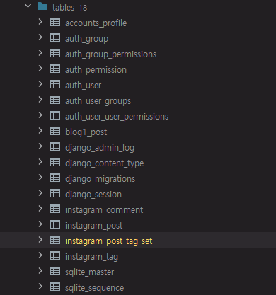

목차   
------

[1. 장고 모델(ORM) 소개](#장고-모델-(ORM)-소개)   
[2. 장고 모델 필드](#장고-모델-필드)   
[3. Media 파일 다루기](#Media-파일-다루기)   
[4. QuerySet을 통한 간단 검색 구현](#QuerySet을-통한-간단-검색-구현)     
[5. QuerySet의 정렬 및 범위 조건](#QuerySet의-정렬-및-범위-조건)   
[6. django-debug-toolbar](#django-debug-toolbar)   
[7. ForeignKey](#ForeignKey)  
[8. OneToOneField](#OneToOneField)
[9. ManyToManyField](#ManyToManyField)  

장고 모델 (ORM) 소개 
---

Object Relational mapping   
어떤 sql이 쓰여 있는지 파악을 하고 최적화 할 수 있어야 함   
RDB 만을 지원한다.    
mysql, oracle, postgresql 등을 지원   

### 장고 Shell에서 테스트하기

```shell
python manage.py shell
>>> from django.db import connection
>>> cursor = connection.cursor()
>>> with connection.cursor() as cursor:
    cursor.execute("UPDATE bar SET foo =1 WHERE baz= %s", [self.baz])
    cursor.execute("SELECT foo FROM bar WHERE bar= %s", [self.baz])
    row = cursor.fetchone()
    print(row)
>>> cursor.close()
```

장고 모델 필드
---

클래스 명은 Pascal Case 네이밍   

모델 생성 순서
* 모델 클래스 작성
* 마이그레이션 파일 생성: makemigrations
* 마이그레이션 파일을 적용: migrate
* 모델을 적용

외부 데이터베이스 형상을 활용하는 경우
* inspectdb 명령 사용

### 장고 앱 만들고 등록 하기 
* instagram 앱 생성
    ```shell
    python manage.py startapp instagram
    ```
* settings에 INSTALLED_APPS에 instagram 추가
* urls.py 추가하고 urlpatterns 리스트 생성
* 프로젝트의 urls.py에서 include('instagram.urls') 매핑
* instagram의 models.py에서 Post 클래스 만들기
    ```python
  class Post(models.Model):
        message = models.TextField()
        created_at = models.DateTimeField(auto_now_add=True)
        updated_at = models.DateTimeField(auto_now=True)
    ```
* makemigrations instagram
* migrate instagram
* 쿼리 보기
    ```shell
    python manage.py sqlmigrate instagram 0001_initial
    ```
* DBshell (sqllist 설치되어 있어야 함)
    ```shell
    python manage.py dbshell
    sqlite>.tables
    sqlite>.schedma shop_item
    sqlite>.quit
    ```
### 장고 모델 필드 타입

* primary Key: AutoField
* 문자열 
* 날짜/시간
* Relationship Types
  * ForeignKey
  * ManyToManyField
  * OneToOneField

### 장고 모델 예제

```python
from django.conf import settings
from django.db import models

class Profile(models.Model):
    user = models.OneToOneField(settings.AUTH_USER_MODEL, on_delete=models.CASCADE)
    blog_url = models.URLField(blank=True)

class Post(models.Model):
    '''
    블로그 포스트
    '''
    author = models.ForeignKey(settings.AUTH_USER_MODEL, on_delete=models.CASCADE)
    title = models.CharField(max_length=100, db_index=True)
    slug = models.SlugField(allow_unicode=True, db_column=True) #제목과 숫자로 이루어진 url 생성시 사용
    desc = models.TextField(blank=True) # 빈문자열도 허용
    image = models.ImageField(blank=True)
    comment_count = models.PositiveIntegerField(default=0) # 양수만 처리
    tag_set = models.ManyToManyField('Tag', blank=True) # 하나의 포스트는 다수의 태그
    is_publish = models.BooleanField(default = False)
    created_at = models.DateTimeField(auto_now_add = True)
    updated_at = models.DateTimeField(auto_now=True)
    
class Comment(models.Model):
    '''
    한명의 유저가 여러 개의 댓글
    '''
    author = models.ForeignKey(settings.AUTH_USER_MODEL, on_delete=models.CASCADE)
    post = models.ForeignKey(Post, on_delete=models.CASCADE)
    message = models.TextField()
    created_at = models.DateTimeField(auto_now_add=True)
    updated_at = models.DateTimeField(auto_now=True)
    
class Tag(models.Model):
    name = models.CharField(max_length=50, unique=True)

```

### 중요

* blank/null 은 최소화
* 직접 유효성 로직을 만들지 말고 장고의 기능을 가져다 쓸 것 !!!
* validation은 Tight 하게 지정

Media 파일 다루기
-------------------
FileField/ImageField가 있음

1. models에서 이미지 필드를 지정한다.   
필요시 pillow를 설치한다. 
```python
#instagram/models.py
class Post(models.Model):
    photo = models.ImageField(blank=True, upload_to='instagram/post/%Y%m%d') #upload_to 옵션을 지정해서 파일을 상세 폴더로 분기함
```
```shell
pip install pillow
python manage.py makemigrations instagram
python manage.py migrate instagram
```
2. MEDIA 파일이 저장될 경로를 셋팅한다.
```python
# askcompany/settings.py
MEDIA_URL ='/media/'
MEDIA_ROOT =os.path.join(BASE_DIR, 'media')

#instagram/urls.py
urlpatterns += static(settings.MEDIA_URL, document_root = settings.MEDIA_ROOT)
```
3. Admin 화면에서 이미지가 보이게 한다. 
```python
#instagram/admin.py
list_display = ['id', 'photo_tag', 'message', 'message_length', 'is_public', 'created_at', 'updated_at'] #디스플레이에 출력할 컬럼 지정
def photo_tag(self, post):
    if post.photo:
        return mark_safe(f'')
    return None
```

QuerySet을 통한 간단 검색 구현
-------------------------------

1. url 매핑 
```python
#instagram/urls.py
urlpatterns = [
    path('', views.post_list),
]
```
2. filter 기능 구현
```python
#instagram/views.py
from django.shortcuts import render
from .models import Post

def post_list(reqeust):
    qs = Post.objects.all()
    q = reqeust.GET.get('q','') # q key가 있으면 가져오고, 없으면 ''
    if q:
        qs = qs.filter(message__icontains=q) # 필터링 기능 구현이 됨
        #instagram/templates/instagram/post_list.html
    return render(reqeust, 'instagram/post_list.html', {
        'post_list':qs,
        'q':q, #검색어 자체를 전달하기 위해서
        })
```
3. html 화면 UI
* {{post.photo.url}} 예외 없이 작동하기 위해서 if문 처리
* bootstrap 활용 
* table tag 활용하여 가독성 증가
```html
<!doctype html>
<html lang="ko">
<head>
    <meta charset="utf-8"/>
    <title>Instagram / Post List</title>
    <link rel="stylesheet" href="https://cdn.jsdelivr.net/npm/bootstrap@5.2.1/dist/css/bootstrap.min.css" rel="stylesheet" integrity="sha384-iYQeCzEYFbKjA/T2uDLTpkwGzCiq6soy8tYaI1GyVh/UjpbCx/TYkiZhlZB6+fzT" crossorigin="anonymous">
</head>
<body>
    <form action="" method="get">
        <input type="text" name="q" value="{{ q }}"/>
        <input type="submit" value="검색"/>
    </form>

    <table class="table table-bordered table-hover">
        <tbody>
            
                <tr>
                    <td>
                        
                            
                        
                            No Photo
                        
                    </td>
                    <td>
                        {{ post.message }}
                    </td>
                </tr>
            
        </tbody>
    </table>
</body>
</html>

```

### QuerySet 간단하게 활용하기

pip install django-extensions  
settings.py 에서 django_extensions 추가 (_임에 유의할 것)  
python manage.py shell_plus --print-sql --ipython  

```python
In [1]: from instagram.models import Post

In [2]: Post.objects.all()
Out[2]: SELECT "instagram_post"."id",
       "instagram_post"."message",
       "instagram_post"."photo",
       "instagram_post"."is_public",
       "instagram_post"."created_at",
       "instagram_post"."updated_at"
  FROM "instagram_post"
 LIMIT 21

Execution time: 0.000997s [Database: default]
<QuerySet [<Post: 첫번째 메세지>, <Post: 두번째 메세지>]>

```

```python
#Meta Setting
 class Meta:
        ordering = ['-id']
```
다음과 같이 ordering 된 결과가 나옴
```python
In [1]: Post.objects.all().order_by("created_at")
Out[1]: SELECT "instagram_post"."id",
       "instagram_post"."message",
       "instagram_post"."photo",
       "instagram_post"."is_public",
       "instagram_post"."created_at",
       "instagram_post"."updated_at"
  FROM "instagram_post"
 ORDER BY "instagram_post"."created_at" DESC
 LIMIT 21

```

QuerySet의 정렬 및 범위 조건
---------------------------

단, negative indexing은 지원하지 않는다., 
step은 가능하면 사용하지 않을 것을 권함, step은 쿼리에 대응하지 않음
결과물로 나온값에 step을 적용하여 리스트로 반환
```python
In [3]:  Post.objects.all()[:2]
Out[3]: SELECT "instagram_post"."id",
       "instagram_post"."message",
       "instagram_post"."photo",
       "instagram_post"."is_public",
       "instagram_post"."created_at",
       "instagram_post"."updated_at"
  FROM "instagram_post"
 ORDER BY "instagram_post"."id" DESC
 LIMIT 2

Execution time: 0.000000s [Database: default]
<QuerySet [<Post: 두번째 메세지>, <Post: 첫번째 메세지>]>
```

django-debug-toolbar
-------------------------

### 설치
```shell
pip install django-debug-toolbar
```
```python
# settings에 APP 추가 'debug_toolbar',
INSTALLED_APPS = [
    ...
    'debug_toolbar',
    ...
]

# 프로젝트 폴더 내 urls.py
if settings.DEBUG:
      ...
    import debug_toolbar
    urlpatterns += [
        path('__debug__/', include(debug_toolbar.urls))
    ]

#settings.py에서 
#middleware 추가
MIDDLEWARE = [
    'debug_toolbar.middleware.DebugToolbarMiddleware',
  ]


INTERNAL_IPS = ['127.0.0.1']

```

### 주의사항
* 웹페이지 탬플릿에 body tag 있어야  debug-toolbar가 나옴
* 운영시에는 settings.DEBUG를 False로 셋팅할 것

ForeignKey
-----------------

### RDBM에서의 관계 예시

  1:N 관계: models.ForeignKey  
  1:1 관계: models.OneToOneField  
  M:N 관계: models.ManyToMany  
  
### ForeignKey

1:N 관계에서 N측에 명시   

```python
class Comment(models.Model):
    post = models.ForeignKey(Post, on_delete=models.CASCADE)
    message = models.TextField()
    created_at = models.DateTimeField(auto_now_add=True)
    updated_at = models.DateTimeField(auto_now=True)
```
to: 대상 모델   

on_delete: 삭제시 Rule
* CACADE: FK로 참조된 다른 모델의 Record도 삭제
* SET_NULL, SET_DEFAULT등의 옵션이 있음

### 올바른 User 모델 지정

```python
## setting.py 에서 
AUTH_USER_MODEL = 'auth.User'

## instgram.models.py 에서 
from django.conf import settings

class Post(models.Model):
    author = models.ForeignKey(settings.AUTH_USER_MODEL, on_delete=models.CASCADE)
    message = models.TextField()
```

admin에 등록하기
``` python
@admin.register(Comment)
class CommentAdmin(admin.ModelAdmin):
    pass
```

### FK 에서의  Reverse_name

reverse_name  (==> 역참조하는 모델명_set)
post와 comment의 관계는 1:n 관계이며,  
comment는 post를 foreignkey에 의해 정참조 하고 있음.   
post에서 comment를 참조하고 싶은데 참조할려면 어떻게 해야 하는가?   
`post.comment_set` 으로 접근하며 `comment_set` reverse name이라고 한다. 

```python
class Post(models.Model):
    message = models.TextField()
    photo = models.ImageField(blank=True, upload_to='instagram/post/%Y%m%d') #upload_to 옵션을 지정해서 파일을 상세 폴더로 분기함

class Comment(models.Model):
    post = models.ForeignKey(Post, on_delete=models.CASCADE)
```

```python
## 포스팅에 속한 댓글을 가져오는 방법
##  모두 같은 결과를 내는 코드임
Comment.objects.filter(post_id = 2) #post의 id가 2인 comment를 얻어온다.
Comment.objects.filter(post__id = 2) #post는 외래키인데 그 외래키에 속한 id를 얻어얼수도 있다.
Comment.objects.filter(post = post) # post에 직접 적용하는 방법

# 가장 보기 좋은 코드임 (외래키에서의 Reverse Name)
# 모델명소문자_set 이 default로 생김
post.comment_set.all()
```
### reverse_name 이름 충돌

만약에 comment라는 모델이 blog와 instagram 앱에 모두 존재하는 경우    
각 comment는 post를 참조한다면 이름이 충돌이 날 수 있다.  
아래와 같이 이름 충돌을 회피하는 코드를 작성한다. 

```python
# revers_name을 변경
# blog 엡의 comment
post = models.ForeignKey(Post, ..., related_name ="blog_post_set")
# instagram 앱의 comment
post = models.ForeignKey(Post, ..., related_name="instagram_post_set")
```
### limit_choices_to
 ForeignKey 셋팅하는 부분에서 
 선택항목을 제한한다. 
 
```python
class Comment(models.Model):
    post = models.ForeignKey(Post, on_delete=models.CASCADE,
                             limit_choices_to={'is_public':True})
```

OneToOneField
------------

1:1 관계에서 사용한다.   
ForeignKey와 유사하지만 reverse_name에서 차이가 있다 
O2O에서는 모델명을 그대로 지정한다. 

    profile.user_set.first() --> user  : FK인 경우
    profile.user --> user : O2O인 경우

OnetoOneField 예제 
```python
from django.db import models
from django.conf import settings

class Profile(models.Model):
    user = models.OneToOneField(settings.AUTH_USER_MODEL, on_delete=models.CASCADE)
    address = models.CharField(max_length=100)
    zipcode = models.CharField(max_length=6) #, validators=[])
```

ManyToManyField
---------------------
M:N 관계에서 사용한다. 
두개의 테이블 중 한곳에 셋팅하 된다.
주로 사용하는 쪽에서 ManytoManyField를 작성한다. 
on_delete라는 옵션은 없고 blank라는 옵션이 있다. 

ManyToManyField 생성하기 
```python
class Post(models.Model):
    tag_set = models.ManyToManyField('Tag', blank=True) #tag가 없을수도 있어서  blank 지정

class Tag(models.Model):
    name = models.CharField(max_length=50, unique=True)

```

연결된 Field  값 가져오기 
```python
from instagram.models import Post, Tag
post = Post.objects.last()
post.tag_set.all() #해당 post에 대한 tag 가져오기

tag = Tag.objects.last()
tag.post_set.all()

```

migration을 하면, 다음과 같이 중간 테이블도 하나 만들어진다.    


