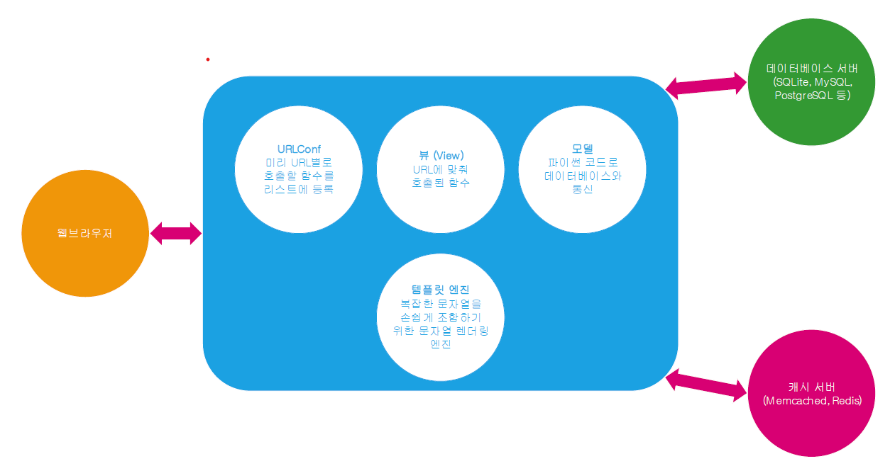

#### 웹 어플리케이션 기본 구조



#### 장고 앱
현재 프로젝트의 블로그의 기능을 다른 프로젝트에서도 사용하고 싶다.   
앱을 하나의 작은 서비스로 보면 된다.  
재사용성의 단위로 끊어서 표현
```shell
python managy.py startapp blog1
```
새롭게 생성한 장고앱은 settings에 등록해야 됨

##### DB 생성하기
```shell
python manage.py makemigrations blog1
python manage.py migrate blog1
```
웹브라우저에서 확인하면 방금생성한 Post 테이블 존재